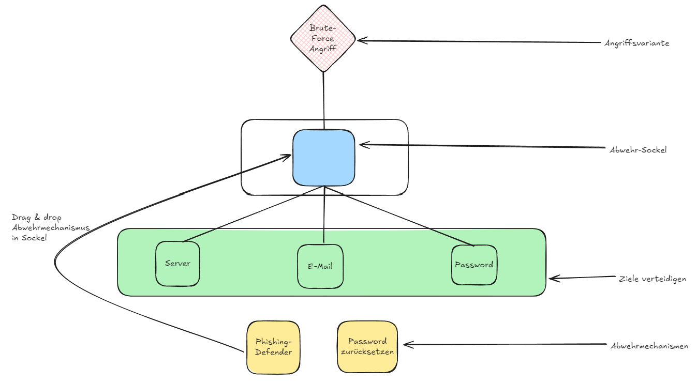

# Übersicht

Defend Dragger ist kein kurzes Minispiel für den zum Thema IT-Sicherheit. Ziel des Spiels ist es so viele Angriffe wie möglich abzuwehren ohne dabei komprommitiert zu werden.

## Wie wird gespielt

In regelmäßigen Abständen erscheinen zufällige Angriffe (Attack Setup) im oberen Teil des Bildschirms. Die Aufgabe des Spielers besteht darin, den richtigen Abwermechanismus (Mechanisms) für den jeweiligen Angriff auszuwählen, zu finden im unteren Teil des Bildschirms. Diese müssen per Drag & Drop in den Defend Socket gesetzt werden. Ist der korrekte Mechanismus gewählt worden, leuchtet dieser grün auf und der Spieler erhält einen Punkt. Wurde jedoch der falsche Mechanismus verwendet, leuchtet dieser rot auf und das jeweilige Ziel des Cyber-Angriffs wird grau.

# Setup

- Lade das Projekt herunter
- Öffne die bash oder eine eine vergleichbare CLI
- Gehe zum verzeichnis 'dist'
- (Optional) Falls serve nicht vorhanden, bitte folgenden Befehl ausführen: npm install -g serve
- Führe folgenden Befehl aus: serve -s .
- Gib eine der angezeigten Adressen in deinem Browser ein
- Viel Spaß!

# Konzeptzeichnung

## Ideen für Weiterentwicklung

- Basierend auf dem Stand des Projektes könnte es um weitere Angriffe mit dazugehörigen Abwehrmechanismen und Ziele erweitert werden.
- Die Anzahl der Defend Sockets könnte erhöht werden, damit bei einem entsprechenden Angriff mehrere (passende) Abwehrmechanismen eingesetzt werden. Dies könnte den Schwierigkeitsgrad über den Verlauf erhöhen.
- Wenn der Angriff wechselt und der Spieler bis dahin keinen Mechanismus eingesetzt hat, würde der Angriff erfolgreich sein. Dies würde zum einem den Schwierigkeitsgrad erhöhen und zum Anderen die Realität näher widerspiegeln, da bei einem Angriff Zeit ein wichtiger Faktor ist.
- Beim Einsetzen eines Mechanismus (egal ob dieser korrekt ist oder nicht) könnte eine Informationsblase daneben erscheinen, um im Detail zu beschreiben, wie der Angriff mit diesem Mechanismus abgewehrt werden kann um die Wissensvermittlung zusätzlich zu erhöhen.
